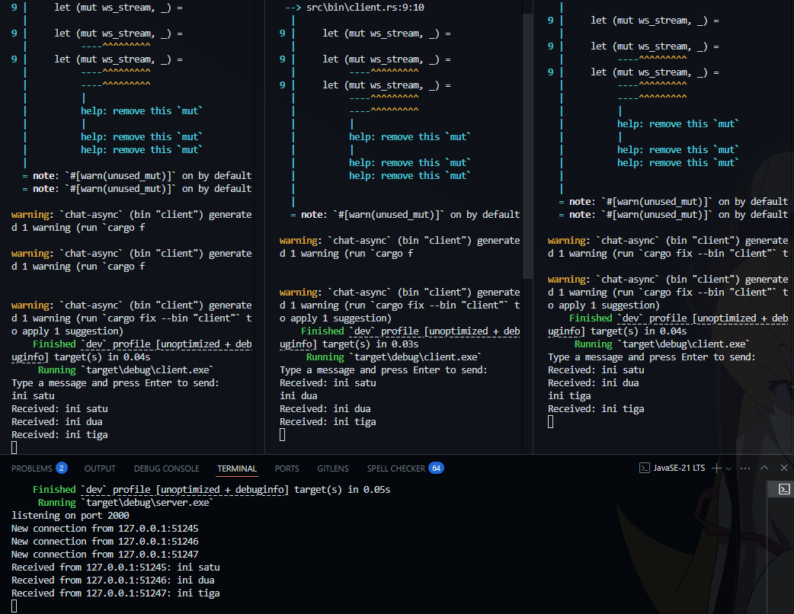
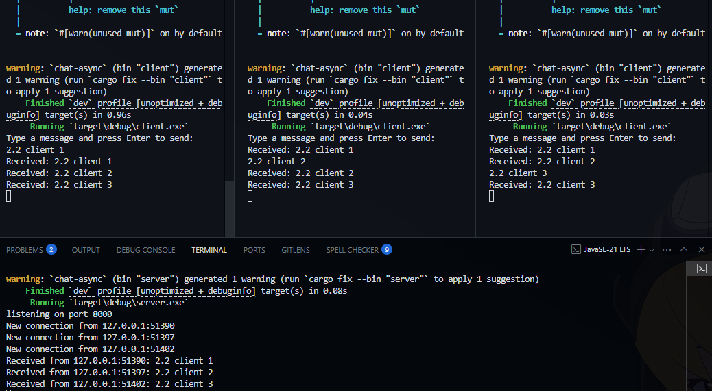
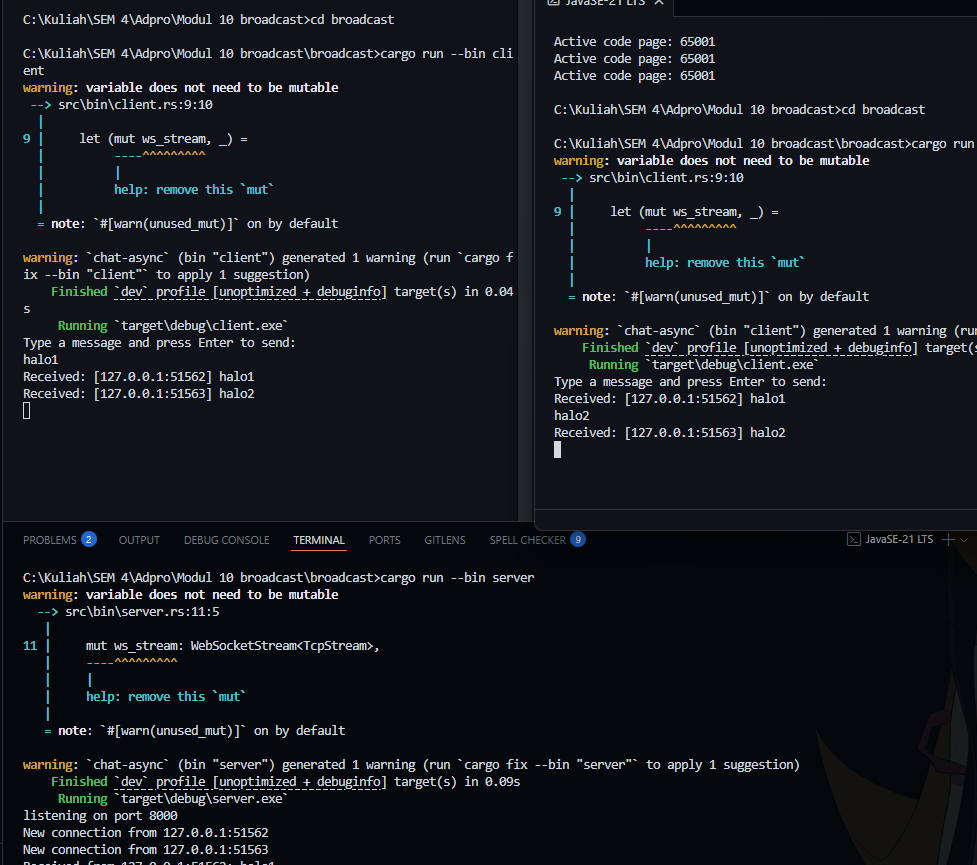
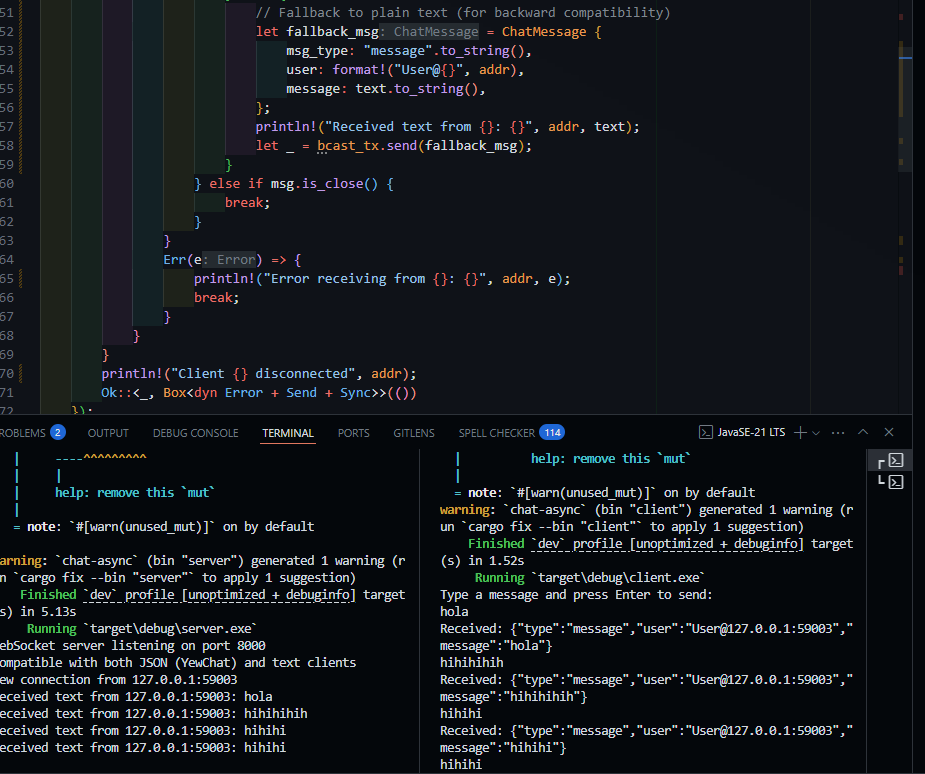

### 2.1. Original code of broadcast chat

()

Implementasi broadcast chat berhasil dijalankan dengan server yang mendengarkan di port 2000 dan tiga client yang terhubung secara bersamaan. Screenshot menunjukkan bagaimana tiap pesan ("ini satu", "ini dua", "ini tiga") yang dikirim oleh satu client diteruskan oleh server ke semua client yang terhubung. Server mencatat setiap koneksi baru dengan alamat IP dan port masing-masing client (127.0.0.1:51245, 127.0.0.1:51246, 127.0.0.1:51247). Sistem broadcast berfungsi sebagaimana mestinya, dimana setiap pesan yang dikirim ke server didistribusikan kembali ke semua client tanpa terkecuali. Arsitektur broadcast ini memungkinkan komunikasi grup dimana semua peserta dapat melihat pesan dari siapa saja dalam jaringan.

### 2.2. Modifying port

Untuk implementasi broadcast chat dengan port yang dimodifikasi, perlu dilakukan perubahan pada dua file utama. Pertama, pada server.rs, port binding diubah dari 8000 menjadi 8080 dengan mengubah 

`TcpListener::bind("127.0.0.1:8000")` menjadi `TcpListener::bind("127.0.0.1:8080")`. 

Kedua, pada client.rs, URI WebSocket diubah dari 

`ws://127.0.0.1:8000` menjadi `ws://127.0.0.1:8080`.

Aplikasi tetap menggunakan protokol WebSocket yang diindikasikan oleh skema URI ws:// pada client dan penggunaan library tokio_websockets dengan komponen ServerBuilder dan WebSocketStream pada server. Setelah modifikasi port dilakukan, fungsionalitas broadcast masih berjalan dengan baik karena seluruh komponen aplikasi telah disesuaikan untuk menggunakan port yang sama (8080) dan protokol yang sama (WebSocket). Pengujian dengan multiple client menunjukkan bahwa pesan tetap berhasil didistribusikan ke semua client yang terhubung.

### 2.3. Small changes: Add IP and Port to Broadcast Message

Pada eksperimen ini, dilakukan modifikasi kecil pada server agar setiap pesan yang diterima dari client akan dibroadcast ke semua client lain dengan tambahan informasi alamat IP dan port pengirim. Perubahan ini dilakukan dengan menambahkan format `[IP:PORT] pesan` pada setiap pesan yang dikirimkan server ke client.

Hasilnya, setiap client dapat melihat dengan jelas siapa pengirim pesan berdasarkan alamat IP dan port yang tertera di awal pesan. Hal ini membantu dalam memahami alur pesan dan asal pesan pada sistem chat, meskipun belum ada fitur username.

Perubahan ini penting untuk debugging dan transparansi komunikasi antar client, serta dapat menjadi dasar untuk pengembangan fitur identitas pengguna di masa depan.

**Alasan perubahan:**
Agar setiap client dapat mengetahui asal pesan (IP dan port pengirim), sehingga komunikasi lebih informatif dan mudah ditelusuri.

### BONUS Change the websocket server!

Dalam pengembangan ini, server WebSocket Rust dari Tutorial 2 dimodifikasi untuk dapat melayani webchat berbasis Yew dari Tutorial 3. Perubahan utama fokus pada format komunikasi, di mana server sekarang dapat menangani format JSON yang digunakan oleh frontend Yew, tidak hanya text sederhana. Modifikasi ini berhasil karena WebSocket pada dasarnya bersifat transport-agnostic—tidak peduli format data yang dikirimkan selama pengiriman tetap sebagai text message. Untuk mengimplementasikan perubahan ini, server Rust ditambahkan kemampuan untuk melakukan serialisasi dan deserialisasi pesan JSON dengan memanfaatkan struct ChatMessage dan library serde_json. Server juga tetap mendukung backward compatibility untuk client text sederhana. Sebagai perbandingan dengan server JavaScript, implementasi Rust menawarkan keunggulan signifikan dalam hal memory safety, performa, konkurensi dengan Tokio async runtime, dan type safety dengan compile-time error checking. Meskipun JavaScript memiliki kelebihan dalam kecepatan development dan ekosistem yang lebih besar, untuk aplikasi chat yang membutuhkan reliability dan handling koneksi concurrent dalam jumlah besar, server Rust merupakan pilihan yang lebih optimal dengan throughput yang lebih tinggi, penggunaan memori yang lebih efisien, dan latency yang lebih rendah pada skenario high-load.